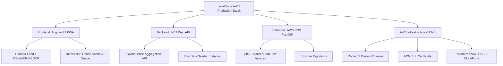

# 🔍 LensClone Production Readiness Audit & Implementation Plan

> **Audit Assessment Date**: August 2026  
> **Product Positioning**: Real-Time Visual Price Comparison for **Small Neighborhood Grocery Stores** (Bodegas & Minimarkets)  
> **Current Application Status**: **Proof-of-Concept (PoC) / Early Prototype**  
> **Production Readiness Score**: **22 / 100** 🔴 (Critical gaps in Security, Spatial DB Indexing, AWS Deployment Setup, and Offline Sync)

---

## 🎯 Scope & Product Boundaries (Updated)

Based on product specifications:
* 🏪 **Target Market**: **Small local neighborhood grocery stores, minimarkets, and corner shops** (NOT large supermarket chains).
* 🚫 **No Barcode Scanning**: Product recognition relies **100% on OCR text detection (DBNet + CRNN)** and visual tag parsing. Barcodes (EAN-13/UPC) are explicitly out of scope.
* 💵 **Single Currency**: Operates in local currency only. Multi-currency engines and inflation adjustment logic are excluded.
* 🧪 **Dev Data Seeding**: Robust local development seeding mechanisms must exist to populate neighborhood store clusters and test observations.
* ☁️ **AWS Infrastructure & Custom Domain**: Production architecture targets **AWS** (ECS/App Runner, RDS PostgreSQL + PostGIS, S3/CloudFront) configured with **Route 53 DNS** and **ACM SSL certificates** for a user-owned custom domain.

---

## 🏗️ Technical Architecture & Key Gaps



---

## 🛠️ Deep Critique by Domain

### 1. Vision & ML Pipeline (OCR-Only for Neighborhood Stores)

#### ❌ Current Weaknesses & Missing Features
* **OCR Reliability on Small-Store Price Tags**: Shelf tags in local grocery stores are often handwritten, printed on non-standard tags, or poorly illuminated. The current CRNN model ([crnn-recognizer.service.ts](file:///d:/Repositories/lensClone/PoC-LensClone/src/app/services/text-detection/recognition/crnn-recognizer.service.ts)) relies on CTC greedy decoding without N-gram language models, resulting in misreads (`$ IS00` vs `$ 1500`, `0` vs `O`).
* **Lack of Fuzzy Neighborhood Product Dictionary**: Without barcodes, product matching relies entirely on string matching against product names. Current spatial matching lacks fuzzy Levenshtein / trigram matching for minor OCR errors on local grocery items (e.g. `"PAN FRANCES"`, `"LECHE ENTERA"`).
* **Uncompressed Model Asset Delivery**: The ~20-50MB ONNX WASM binaries ([public/models/](file:///d:/Repositories/lensClone/PoC-LensClone/public/models/)) are served via standard uncompressed HTTP requests without progressive loading or browser IndexedDB caching.

---

### 2. Backend Architecture, Spatial Database & Data Seeding (.NET & PostGIS)

#### ❌ Current Weaknesses & Missing Features
* **Missing EF Core Database Migrations**: [Program.cs](file:///d:/Repositories/lensClone/LensClone-Backend/LensClone.Api/Program.cs#L38) uses `EnsureCreated()`, which **disables EF Core schema migrations**. Schema evolution in production will be impossible without dropping PostgreSQL tables.
* **Missing Spatial & Trigram Indexes**:
  * No `GIST` index on `PriceSubmissions.Location` (`Point`), turning spatial queries (`IsWithinDistance`) into **full table scans**.
  * No `GIN` trigram index (`pg_trgm`) on `ProductName` for fast fuzzy searching of local grocery items.
* **Unnormalized Schema for Neighborhood Stores**: [PriceSubmission.cs](file:///d:/Repositories/lensClone/LensClone-Backend/LensClone.Api/Models/PriceSubmission.cs) stores raw text strings instead of relational entities for local grocery stores (`NeighborhoodStore`), product categories (`Category`), and normalized price observations (`PriceObservation`).
* **Dev Environment Seeding Requirements**: While a basic [DataSeeder.cs](file:///d:/Repositories/lensClone/LensClone-Backend/LensClone.Api/Data/DataSeeder.cs) exists, it seeds flat un-normalized test observations. It must be updated to seed realistic **neighborhood grocery store clusters**, local products, and spatial price observations via CLI flags (`dotnet run --seed`) and API (`POST /api/v1/dev/seed`).

---

### 3. Security, Authentication & Data Integrity

#### ❌ Current Weaknesses & Missing Features
* **Unauthenticated Backend Endpoints**: [PricesController.cs](file:///d:/Repositories/lensClone/LensClone-Backend/LensClone.Api/Controllers/PricesController.cs) endpoints (`/submit`, `/compare`) are completely unauthenticated (`[AllowAnonymous]`), leaving the spatial DB open to price data spam and vandalism.
* **Spoofable Device Fingerprinting**: Device IDs are generated on the client in `localStorage`, making spatial deduplication easy to bypass programmatically.
* **Missing ASP.NET Core RateLimiter**: No rate limiting or IP bucket restrictions exist to prevent malicious automated requests.

---

### 4. Offline Capabilities, Storage & PWA Support

#### ❌ Current Weaknesses & Missing Features
* **Synchronous 5MB LocalStorage Cap**: History ([history.service.ts](file:///d:/Repositories/lensClone/PoC-LensClone/src/app/services/history/history.service.ts)) and shopping lists are saved in `localStorage`, risking quota limits and blocking the UI thread.
* **Silent Network Failures in Neighborhood Stores**: Users in basement or thick-walled local grocery stores experience poor cell coverage. Current frontend ([price-api.service.ts](file:///d:/Repositories/lensClone/PoC-LensClone/src/app/services/backend/price-api.service.ts#L57)) swallows network errors silently without persistent offline request queueing.
* **Missing Service Worker & PWA Manifest**: App cannot be installed on mobile home screens or loaded offline.

---

### 5. AWS Infrastructure, Custom Domain & Deployment Design

#### ❌ Current Weaknesses & Missing Features
* **Hardcoded Localhost Configuration**: Frontend API endpoints default to `http://localhost:5276` and backend CORS hardcodes `http://localhost:4200`.
* **Missing AWS Production Infrastructure Code**: The current repository contains only a basic local `docker-compose.yml`. Infrastructure automation for AWS must be established:
  * **Domain & SSL**: AWS Route 53 DNS configuration mapping the custom domain, coupled with AWS Certificate Manager (ACM) for auto-renewed TLS/SSL certificates.
  * **API & Database**: Containerized deployment via **AWS App Runner** or **AWS ECS Fargate**, backed by an **AWS RDS PostgreSQL (PostGIS enabled)** instance.
  * **Frontend CDN**: Static web hosting via **AWS S3 + CloudFront CDN** for instant global asset distribution.

---

## 📋 Comprehensive Missing Features Checklist

| # | Domain | Requirement / Feature Description | Severity | Target Component |
| :-: | :--- | :--- | :-: | :--- |
| 1 | **Security** | Implement OAuth2/OIDC (Google/Email) with JWT Bearer authentication on backend API endpoints | 🔴 Critical | `AuthService`, `PricesController` |
| 2 | **Security** | Add ASP.NET Core RateLimiter middleware (IP & User bucket rate limits) | 🔴 Critical | `LensClone.Api` |
| 3 | **Database** | Replace `EnsureCreated()` with EF Core Migrations (`dotnet ef migrations add InitialCreate`) | 🔴 Critical | `ApplicationDbContext` |
| 4 | **Database** | Add `GIST` spatial index on `Location` & `GIN` trigram index on `ProductName` | 🔴 Critical | `ApplicationDbContext` |
| 5 | **Database** | Normalize database schema to include `NeighborhoodStore`, `ProductCatalog`, and `PriceObservation` | 🟠 High | `LensClone.Api/Models` |
| 6 | **Dev Setup** | Upgrade dev data seeding pipeline ([DataSeeder.cs](file:///d:/Repositories/lensClone/LensClone-Backend/LensClone.Api/Data/DataSeeder.cs)) to populate spatial neighborhood store clusters via CLI & API | 🟠 High | `DevController`, `DataSeeder` |
| 7 | **Infrastructure** | Terraform / AWS IaC setup for RDS PostGIS, ECS/App Runner, Route 53 Custom Domain & ACM SSL Certs | 🔴 Critical | `infrastructure/` |
| 8 | **Frontend** | Migrate scan history & shopping list storage from `localStorage` to IndexedDB (`dexie.js` / `idb`) | 🟠 High | `HistoryService`, `ShoppingListService` |
| 9 | **Frontend** | Implement persistent HTTP offline request queue with Service Worker background sync | 🔴 Critical | `PriceApiService` |
| 10 | **Vision / ML** | Implement fuzzy Levenshtein / trigram dictionary matching for OCR product names on paper price tags | 🟠 High | `DictionaryMatcherService` |
| 11 | **Vision / ML** | Add WASM model binary caching in IndexedDB for fast app startups | 🟠 High | `DetectorService`, `PipelineWorker` |
| 12 | **Core Feature** | Connect frontend `HeatmapService` to live backend spatial aggregation API for local grocery stores | 🔴 Critical | `HeatmapService`, `PricesController` |
| 13 | **PWA** | Full PWA Web App Manifest, Service Worker offline Shell caching, and mobile install prompt | 🟠 High | `angular.json`, `manifest.webmanifest` |
| 14 | **Observability** | Add Serilog structured JSON logging and ASP.NET Core Health Check probes (`/healthz`) | 🟠 High | `LensClone.Api` |
| 15 | **Testing** | Create `LensClone.Tests` backend test suite with xUnit & Testcontainers for PostGIS spatial testing | 🟠 High | Backend Solution |
| 16 | **DevOps** | GitHub Actions CI/CD workflow for automated test execution, Docker container building, and AWS deployment | 🟡 Medium | `.github/workflows/` |

---

## 🗺️ Updated Phased Implementation Roadmap

```mermaid
timeline
    title LensClone Updated AWS & Neighborhood Focus Roadmap
    section Phase 1: Security, DB & AWS Infra
        EF Core Migrations : GIST & GIN Spatial Indexes : Dev Data Seeding Engine : AWS IaC & Route 53 DNS Setup
    section Phase 2: Schema & Real Spatial APIs
        Neighborhood Store Relational Models : PostGIS Spatial Aggregation API : Connect Heatmap UI to API
    section Phase 3: OCR Optimization & Offline Sync
        Fuzzy Product Dictionary Matching : IndexedDB Storage Migration : Offline Request Queueing : WASM Cache
    section Phase 4: PWA, CI/CD & Production
        Service Worker & PWA Install : Backend xUnit Test Suite : GitHub Actions to AWS Deployment
```

### Phase 1: Security, Database & AWS Infrastructure (Week 1–2)
1. **EF Core Schema Migrations**: Create initial migration (`dotnet ef migrations add InitialCreate`) and update `Program.cs` to execute `db.Database.Migrate()`.
2. **PostGIS & Text Indexes**: Add `GIST` spatial index on `Location` and `GIN` trigram index (`pg_trgm`) on `ProductName`.
3. **Dev Data Seeding**: Enhance `DataSeeder.cs` and `DevController.cs` to populate realistic spatial clusters of small neighborhood grocery stores and products for local development.
4. **AWS Infrastructure & Domain Setup**: Define Terraform / IaC configuration:
   - AWS Route 53 hosted zone for custom domain.
   - AWS Certificate Manager (ACM) SSL certificate provision.
   - AWS RDS PostgreSQL containerized with PostGIS.
   - AWS ECS Fargate or App Runner service definition.

### Phase 2: Neighborhood Store Data Model & Real APIs (Week 3–4)
1. **Normalized Store Schema**: Create `NeighborhoodStore`, `ProductCatalog`, and `PriceObservation` entities.
2. **Spatial Aggregation Endpoints**: Build `POST /api/v1/prices/compare` and `GET /api/v1/heatmap/stores` to return real spatial statistics for local neighborhood shops.
3. **Frontend API Integration**: Replace mock data arrays in `HeatmapService` with live backend HTTP calls to the PostGIS spatial API.

### Phase 3: OCR Fuzzy Matching & Offline Capabilities (Week 5–6)
1. **Fuzzy OCR Dictionary Matching**: Implement fuzzy trigram/Levenshtein matching in `DictionaryMatcherService` to handle handwritten or imperfect paper tag OCR reads.
2. **IndexedDB Storage**: Replace synchronous `localStorage` with asynchronous `idb` for scan history and shopping lists.
3. **Offline Queueing**: Store failed price submissions in IndexedDB when offline, automatically syncing when connection is restored in a local shop.

### Phase 4: PWA, Quality & Continuous Deployment (Week 7–8)
1. **PWA Capability**: Add Web App Manifest and Service Worker static asset caching.
2. **Backend Unit & Spatial Tests**: Implement `LensClone.Tests` with `xUnit` and `Testcontainers.PostgreSql`.
3. **CI/CD Pipeline**: Setup GitHub Actions workflow to run tests, compile Angular production bundles, build Docker images, and deploy to AWS.

---

> [!IMPORTANT]
> **Summary**: With the focus narrowed to small neighborhood grocery stores and OCR detection, implementation can focus deeply on **fuzzy text matching, robust offline submission queueing for low-reception shops, dev data seeding, and automated AWS IaC deployment**.
